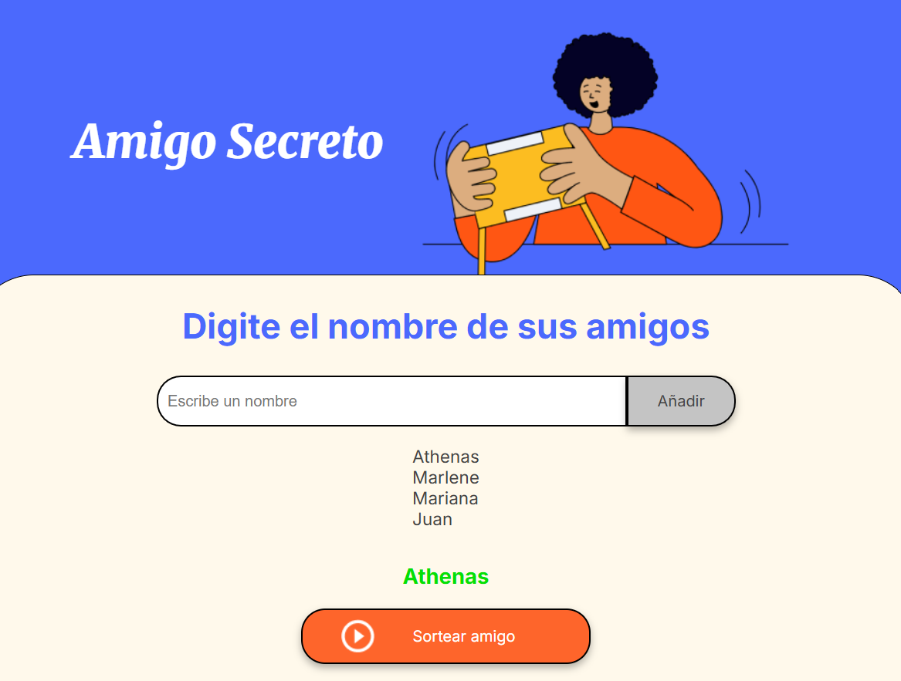
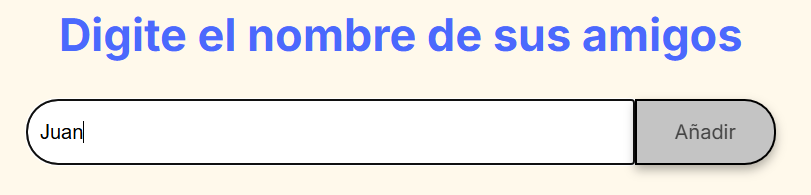
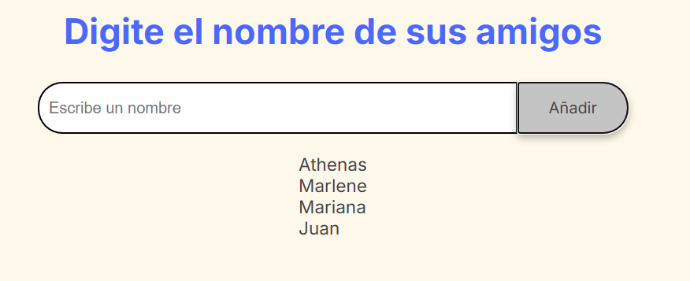

# Challenge del Amigo Secreto  🎁

## Descripción
Este proyecto es un desafío de **lógica de programación** en JavaScript.  
Permite agregar amigos a una lista y realizar un sorteo aleatorio para seleccionar a un amigo secreto.

---

## Funcionalidades

1. **Agregar amigos**
   - Ingresa el nombre de un amigo en el campo de texto.
   - Presiona el botón "Agregar" para añadirlo a la lista.
   - El input se limpia automáticamente para ingresar un nuevo nombre.
   - La lista visible se actualiza dinámicamente.

2. **Listar amigos**
   - Todos los amigos agregados se muestran en una lista en pantalla.
   
3. **Sortear un amigo secreto**
   - Presiona el botón "Sortear" para seleccionar un amigo al azar.
   - El resultado se muestra en pantalla.
   - Si no hay amigos en la lista, se muestra una alerta solicitando agregar al menos uno.

---

## Capturas de pantalla

**Agregar amigos:**  

**Lista de amigos actualizada:**  

**Resultado del sorteo:**  

---

## Estructura del Código

- `amigos` → Array que almacena los nombres de los amigos.  
- `agregarAmigo()` → Toma el valor del input, lo agrega al array, limpia el input y actualiza la lista en pantalla.  
- `actualizarLista()` → Recorre el array `amigos` y actualiza la lista en el HTML.  
- `sortearAmigo()` → Selecciona aleatoriamente un amigo del array y muestra su nombre en pantalla.

---

## Cómo usar

1. Abre el archivo HTML en tu navegador.  
2. Escribe un nombre en el campo de texto y haz clic en **Agregar**.  
3. Repite el proceso para todos los amigos que quieras incluir.  
4. Haz clic en **Sortear** para elegir un amigo secreto al azar. 
